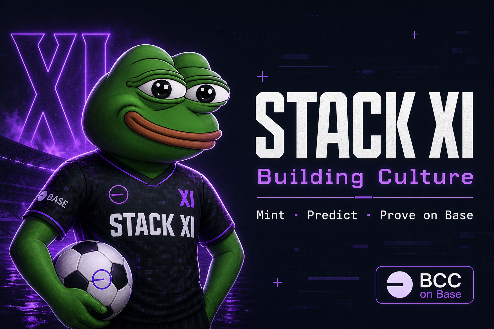

# STACK XI · Building Culture Pepe

**Live:** [pepe.buildingcultureid.space](https://pepe.buildingcultureid.space)

World Cup matchday culture on Base — mint the founding squad with **BCC**, predict with conviction, swap in-app, and prove it onchain. Pepe doesn't chase. Luck does.



## What this is

- **Squad mint** — 11-player ERC-721 bonding curve paid in BCC (Clanker on Base)
- **Matchday predict** — guided BCC stakes tied to Dallas / World Cup schedule
- **Onchain proof hub** — contracts, DexScreener, swap widget, tx receipts at `/proof`
- **Farcaster mini-app** — manifest at `/.well-known/farcaster.json`
- **Culture layer** — member XP, streaks, leaderboard, viral post calendar

## Stack

| Layer | Tech |
|-------|------|
| App | [TanStack Start](https://tanstack.com/start) + React 19 |
| Wallet | wagmi v3 + viem on Base mainnet |
| Token | BCC (Building Culture Coin) — Clanker fair launch |
| Contracts | Foundry — `StackXISquad`, `PredictionPool` |
| SEO | Build-time sitemap / robots / Farcaster manifest from `VITE_SITE_URL` |

## Quick start

```bash
bun install
cp .env.example .env   # fill contract addresses + RPC
bun run dev
```

Open [http://localhost:3000](http://localhost:3000).

### Required env (minimum)

- `VITE_SQUAD_NFT_ADDRESS`, `VITE_PREDICTION_POOL_ADDRESS`, `VITE_BCC_TOKEN_ADDRESS`
- `BASE_RPC_URL` or `ALCHEMY_API_KEY` for server/scripts
- `VITE_SITE_URL=https://pepe.buildingcultureid.space`

See [`.env.example`](.env.example) for the full list.

## Scripts

| Command | Purpose |
|---------|---------|
| `bun run dev` | Local dev server |
| `bun run build` | `generate:seo` + production build |
| `bun run generate:seo` | Write sitemap, robots, farcaster.json from `VITE_SITE_URL` |
| `bun run seo:check` | Fail if public SEO assets drift from env |
| `bun run check:links` | Footer routes vs route tree + sitemap |
| `bun run test:bcc-flows` | BCC config + on-chain read smoke tests |
| `bun run test:step3` | Step-3 integration checks |
| `bun run test:swap-config` | Swap status / env mode checks |
| `bun run audit:onchain` | On-chain + link audit |
| `bun run deploy:base` | Deploy contracts to Base (needs deployer key) |
| `bun run contracts:build` | `forge build` |

## Contracts (Base mainnet)

Set in env — verify on [BaseScan](https://basescan.org) before signing:

| Contract | Env var |
|----------|---------|
| BCC token | `VITE_BCC_TOKEN_ADDRESS` |
| StackXISquad NFT | `VITE_SQUAD_NFT_ADDRESS` |
| PredictionPool | `VITE_PREDICTION_POOL_ADDRESS` |

## BCC swap (three tiers)

In-app swap for USDC/ETH → BCC uses a **fallback chain** — no 0x dashboard key required for Tier B.

| Tier | Mode | Env |
|------|------|-----|
| **A** | Classic 0x API key (server proxy) | `ZEROX_API_KEY` |
| **B** | x402 micropayments (~$0.01 USDC/request) from **project payer wallet** | `X402_SWAP_PAYER_PRIVATE_KEY` |
| **C** | Deeplinks — Uniswap, Base App, Clanker, Aerodrome | always available |

- **Quotes** are fetched server-side (`/api/swap/price`, `/api/swap/quote`).
- **Execution** uses the **user's connected wallet** (approve + swap tx from 0x calldata).
- Check mode: `GET /api/swap/status` → `{ configured, mode }`.

Fund the x402 payer wallet with USDC on Base before expecting Tier B quotes.

## Deploy

1. Set `VITE_SITE_URL` in Lovable / hosting env.
2. `bun run build` — SEO assets regenerate from env.
3. Point DNS `pepe.buildingcultureid.space` → hosting.
4. Re-sign Farcaster manifest at Warpcast after domain changes.
5. Optional: `VITE_GOOGLE_SITE_VERIFICATION`, `NEYNAR_*` for auto-cast.

## Manual ops

- **DexScreener boost** — checklist on `/proof`
- **Treasury** — transfer squad contract ownership to multisig when ready
- **NFT metadata** — on-chain `tokenURI` may still reference legacy host until contract redeploy

## Project structure

```
src/
  routes/          # TanStack file routes (+ /api/swap/*)
  features/        # UI: squad, predict, proof, swap, defi
  lib/base/        # BCC config, wagmi, contract ABIs
  lib/swap/        # 0x proxy + x402 payer
  lib/story/       # Dallas schedule, Pepe matchday lore
public/
  og/              # Social share image (1200×630)
  .well-known/     # Farcaster mini-app manifest
contracts/         # Solidity (Foundry)
scripts/           # deploy, SEO, audits, tests
```

## Lovable

This repo syncs with [Lovable](https://lovable.dev). Avoid force-pushing rewritten history on the connected branch — see [AGENTS.md](./AGENTS.md).

## License

Private / Building Culture ID — all rights reserved unless otherwise noted.
